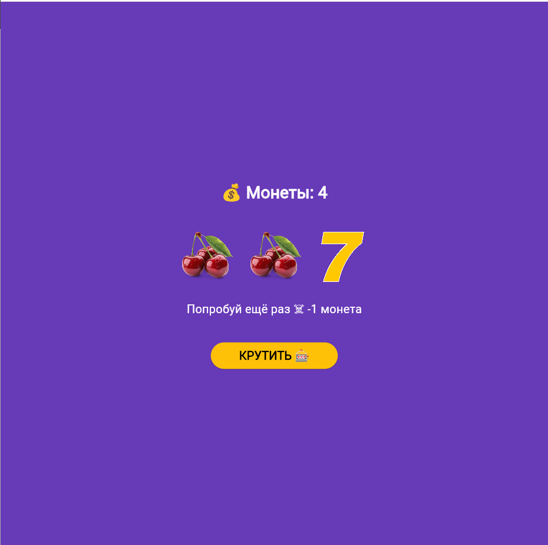
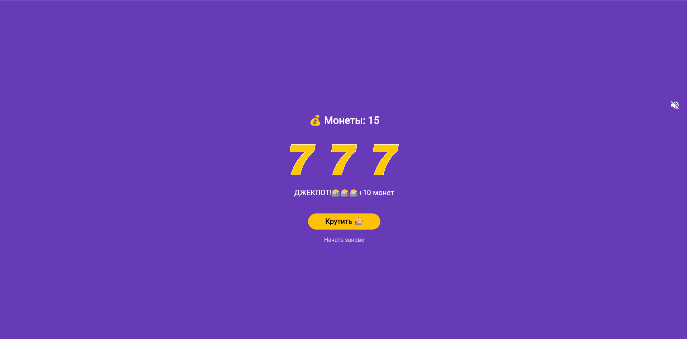
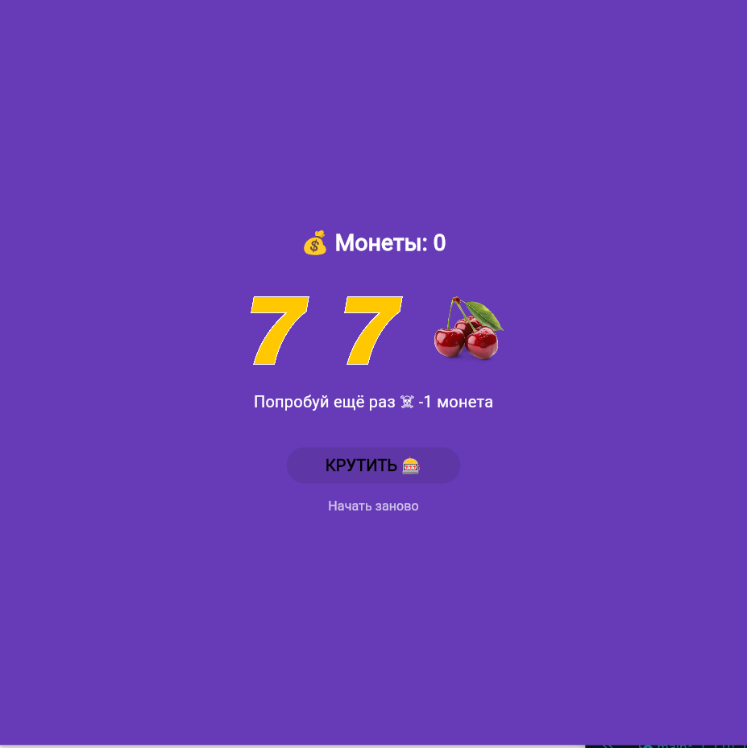

# Slot Machine

Приложение «Слот-машина» на Flutter с анимацией барабанов, звуковыми эффектами и фоновой музыкой.  
Создано в рамках лабораторной работы №6-№7.

## Скриншоты

| Главный экран | Победа | Нет монет |
|---------------|--------|-----------|
|  |  |  |

## Как играть

* Нажмите **КРУТИТЬ**, чтобы запустить барабаны.
* Три одинаковых символа — победа (+3 монеты).
* Три семёрки — джекпот (+10 монет).
* Разные символы — проигрыш (–1 монета).
* Закончились монеты? Нажмите **Начать заново**.

## Запуск проекта

**Требования:** Flutter 3.x, Dart 3.x

```bash
# Клонировать репозиторий
git clone https://github.com/your-username/slot_machine.git

# Перейти в папку проекта
cd slot_machine

# Установить зависимости
flutter pub get

# Запустить в браузере
flutter run -d chrome
```

## Установка на Android

Готовый APK-файл доступен для скачивания: app-release.apk

## Технологии

* Flutter 3.x
* Dart 3.x
* Платформы: Web, Android
* Звук: пакет audioplayers (Web и Android), пул плееров для звуковых эффектов

## Что изучено

* Генерация случайных чисел через dart:math
* Асинхронная анимация с async/await и AnimatedOpacity
* Подключение и воспроизведение звуков: сначала через Web Audio API, затем кроссплатформенно через audioplayers
* Сборка  для Android 


## Автор

Тимонин И.В.
Группа ИСП-233
Лабораторная работа №6-№7, 2026
